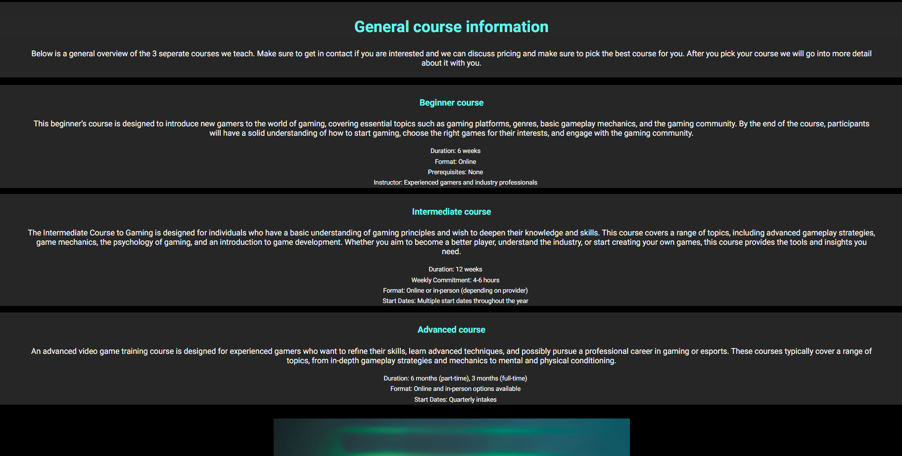

# BetterGaming

BetterGaming is a site for people who want to get better at video games, it is targetted at all age groups 16+, but mainly focuses on 18-29. The goal of the website is to sell courses to people who want to get betetr at video games, whether thats to pay in an esports team or just beat a friend for once.

 
### Existing Features

- __Navigation Bar__

  - Featured on all three pages, the full responsive navigation bar includes links to the Home page, Info and Contact page and is identical in each page to allow for easy navigation.
  - This section will allow the user to easily navigate from page to page across all devices without having to revert back to the previous page via the ‘back’ button. 

- __The landing page image__

  - The landing includes a photograph with text overlay to allow the user to see exactly what this site is for.
  - This section introduces the user to BetterGaming with an eye-catching hero image.

- __Plans Section__

  - The plans section allows the user to see the 3 different courses available to choose from.
  - It allows them to briefly assess what they are looking for.

- __Games we teach__

  - This section will allow the user to see exactly what games we teach. 
  - This section will be updated if/when we add or remove certain games depending on popularity.

- __The Footer__ 

  - The footer section includes links to the relevant social media sites for BetterGaming. The links will open to a new tab to allow easy navigation for the user. 
  - The footer is valuable to the user as it encourages them to keep connected via social media.

- __Info__

  - The info page let's you find out more about each different course. 
  - It is valuable to the user because they can pick the course that suits them best
  - The reason this information isn't on the home page is because it would bombard the user and they wouldn't read it, however after their interest has peaked they can go searching for more information on this seperate page.

- __Contact page__

  - This page allows the user to get into contact with us, they will be required to input their name, email and choose the course and game they would like to be coached in.

## Testing 

In addition, you should mention in this section how your project looks and works on different browsers and screen sizes.

You should also mention in this section any interesting bugs or problems you discovered during your testing, even if you haven't addressed them yet.

If this section grows too long, you may want to split it off into a separate file and link to it from here.

- Orignally the file path was 'url(assets/images/gaming.png)' but the image wasn't showing up on the deployed page so I needed to correct the file path. I changed the file path to 'url(../images/gaming.png) and this fixed the problem.

- These bugs were a simple fix, for the first error I had created 2 IDs with the same name, so all I had to do was rename one and that fixed the bug.
- The next bug had a section without a heading, but because the section didn't need a heading I added a h2 tag but in css said 'display-none' so that the heading wouldn't show up on the page

- The last bug was a silly error, I had put a h4 starting tag and a h3 closing tag, so all I had to do was changed the closing tag to h4 and it solved the problem.

### Validator Testing 

- HTML
  - No errors were returned when passing through the official [W3C validator](https://validator.w3.org/nu/?doc=https%3A%2F%2Fcode-institute-org.github.io%2Flove-running-2.0%2Findex.html)
- CSS
  - No errors were found when passing through the official [(Jigsaw) validator](https://jigsaw.w3.org/css-validator/validator?uri=https%3A%2F%2Fvalidator.w3.org%2Fnu%2F%3Fdoc%3Dhttps%253A%252F%252Fcode-institute-org.github.io%252Flove-running-2.0%252Findex.html&profile=css3svg&usermedium=all&warning=1&vextwarning=&lang=en#css)

### Unfixed Bugs

You will need to mention unfixed bugs and why they were not fixed. This section should include shortcomings of the frameworks or technologies used. Although time can be a big variable to consider, paucity of time and difficulty understanding implementation is not a valid reason to leave bugs unfixed. 

## Deployment

- The site was deployed to GitHub pages. The steps to deploy are as follows: 
  - In the GitHub repository, navigate to the Settings tab 
  - From the source section drop-down menu, select the Master Branch
  - Once the master branch has been selected, the page will be automatically refreshed with a detailed ribbon display to indicate the successful deployment. 

The live link can be found here - https://zakl1.github.io/BetterGaming/index.html 

## Credits 

### Content 

- The text for the Info page was used from ChatGPT
- The HTML used for the contact form was taken from [W3schools](https://www.w3schools.com/)
- The icons in the footer were taken from [Font Awesome](https://fontawesome.com/)
- The fonts were taken from [Google fonts](https://fonts.google.com/)
- The Love Running project helped with some of the basic structure I used like the Nav bar and Footer
- My mentor Jubril Akolade helped me break up the content using a different background shade for the text divs

### Media

- All images are from google images
